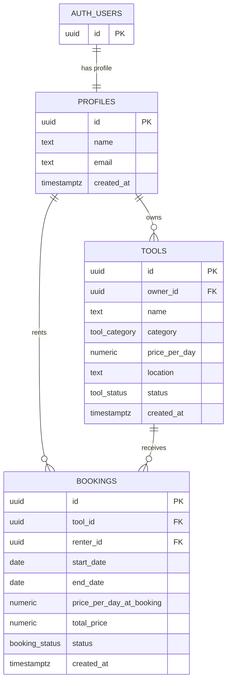
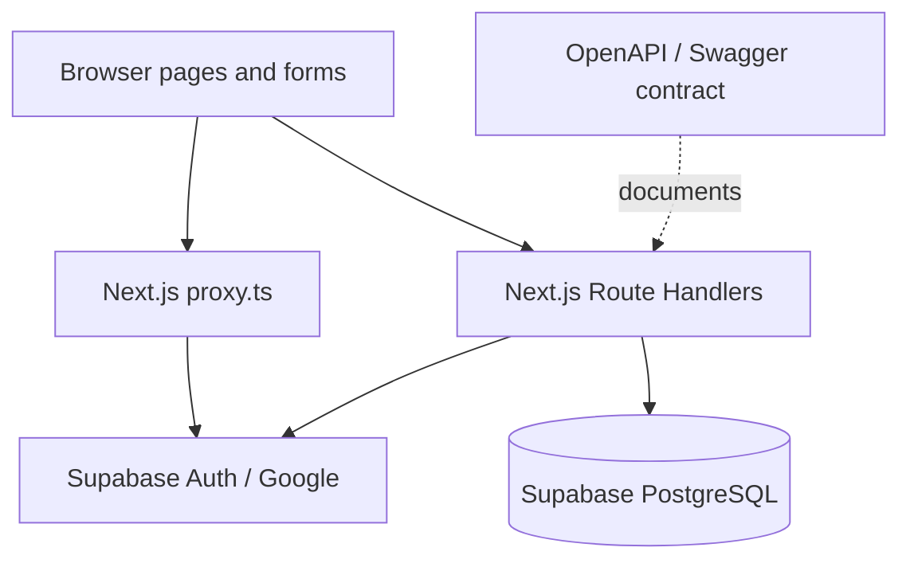

# Toolspace

Toolspace is a peer-to-peer marketplace for renting power tools from nearby owners.

The project uses a modular monolith: Next.js owns the UI, API route handlers, authentication integration, validation, and database access in one repository.

## Current MVP flow

```mermaid
flowchart LR
  A[Visitor] --> B{Authenticated?}
  B -- No --> C[/login]
  C --> D[Google OAuth]
  D --> E[/auth/callback]
  E --> F[Marketplace]
  B -- Yes --> F[/]
  F --> G[Tool details]
  G --> H[Select start and return dates]
  H --> I[POST /api/bookings]
  I --> J{Server validation}
  J -- Invalid or unavailable --> K[Helpful error]
  J -- Valid --> L[PENDING booking]
  F --> M[/tools/new]
  M --> N[POST /api/tools]
```

## Domain entities

### User / Profile

Authentication is handled by Supabase Auth. The application profile is stored in `public.profiles`.

| Field | Description |
| --- | --- |
| `id` | Same UUID as `auth.users.id` |
| `name` | Display name from Google profile |
| `email` | Authenticated email |
| `created_at` | Profile creation time |

### Tool

A power tool listed by a user for rental.

| Field | Description |
| --- | --- |
| `id` | Tool UUID |
| `owner_id` | User who owns the listing |
| `name` | Listing name |
| `description` | Condition and included accessories |
| `category` | Drill, saw, sander, etc. |
| `price_per_day` | Current rental price; must be greater than zero |
| `location` | Pickup area |
| `image_url` | Optional image URL |
| `status` | `ACTIVE`, `PAUSED`, `DAMAGED`, or `REMOVED` |

Only `ACTIVE` tools appear in the marketplace and can be booked.

### Booking

A rental request for a tool. Dates use the half-open range `[start_date, end_date)`, where the end date is the return date.

| Field | Description |
| --- | --- |
| `id` | Booking UUID |
| `tool_id` | Tool being rented |
| `renter_id` | Authenticated user requesting the tool |
| `start_date` | First rental day |
| `end_date` | Return date, not charged as a rental day |
| `price_per_day_at_booking` | Price snapshot at request time |
| `total_price` | Server-calculated rental days × snapshot price |
| `status` | `PENDING`, `APPROVED`, `REJECTED`, `CANCELLED`, `ACTIVE`, or `COMPLETED` |

`PENDING` and `APPROVED` bookings block availability. Adjacent periods such as August 10–14 and August 14–18 do not overlap.

### Database relationship diagram



`PROFILES.id` references Supabase `auth.users.id`. `TOOLS.owner_id` references the profile that listed the tool. `BOOKINGS.renter_id` references the user requesting a rental, while `BOOKINGS.tool_id` identifies the listed tool.

## User journeys

### First-time renter

1. Open `/`.
2. Redirect to `/login` because authentication is required for the marketplace.
3. Select **Continue with Google**.
4. Return through `/auth/callback`; Supabase creates the profile automatically.
5. Browse active tools.
6. Open a tool details page.
7. Select a start date and return date.
8. Review the rental-day count and estimated total.
9. Select **Request booking**.
10. See the booking confirmation. The request is saved as `PENDING`.

### Tool owner

1. Select **List a tool**.
2. Enter the name, description, category, daily price, location, and optional image URL.
3. Select **Publish listing**.
4. See the listing confirmation.
5. Open the new listing or return to the marketplace.

### Booking validation

The server rejects:

- Missing or invalid fields
- Unauthenticated requests
- Dates in the past
- End dates equal to or before start dates
- Inactive or missing tools
- Renting a user's own tool
- Overlap with a `PENDING` or `APPROVED` booking
- Client-provided prices or totals that do not match database calculations

## Manual user-flow test

Before considering the MVP ready, verify this sequence:

1. Run the SQL in `supabase/schema.sql`.
2. Configure Google Auth and confirm `/login` works.
3. Create a listing at `/tools/new`.
4. Confirm it appears at `/`.
5. Open the listing and submit a future date range.
6. Confirm a `PENDING` row exists in Supabase `bookings`.
7. Submit the same dates again and confirm the server returns a conflict.
8. Try an end date before the start date and confirm it is rejected.
9. Confirm sign out returns to `/login`.

## Architecture



## Tech stack

- Next.js 16 App Router with Turbopack
- React 19 and TypeScript
- Supabase Auth and PostgreSQL
- `@supabase/ssr` for cookie-based sessions
- Zod for API validation
- OpenAPI 3.0 Swagger contract

## Local setup

```bash
npm install
cp .env.example .env.local
npm run dev
```

Set these values in `.env.local`:

```env
NEXT_PUBLIC_SUPABASE_URL=https://your-project-ref.supabase.co
NEXT_PUBLIC_SUPABASE_PUBLISHABLE_KEY=your-publishable-key
NEXT_PUBLIC_SITE_URL=http://localhost:3000
```

For a new Supabase project, run [supabase/schema.sql](./supabase/schema.sql) in the Supabase SQL Editor. If you already ran the earlier schema and see `type "tool_status" already exists`, run [supabase/upgrade-existing.sql](./supabase/upgrade-existing.sql) instead. Do not delete your database.

Configure Google in Supabase under Authentication → Providers → Google. The Google OAuth redirect URI is:

```text
https://YOUR_PROJECT_REF.supabase.co/auth/v1/callback
```

## Pages

| Route | Purpose | Auth |
| --- | --- | --- |
| `/login` | Google sign-in | Public |
| `/` | Active marketplace listings | Required |
| `/tools/[id]` | Tool details and booking form | Public view, auth required to book |
| `/tools/new` | Create a listing | API requires auth |
| `/dashboard` | Owner listings and incoming requests | Required |

## API endpoints

The canonical contract is [docs/openapi.yaml](./docs/openapi.yaml). Protected endpoints use:

```http
Authorization: Bearer <supabase-access-token>
```

| Method | Endpoint | Purpose | Status |
| --- | --- | --- | --- |
| `GET` | `/api/tools` | List active tools | Implemented |
| `POST` | `/api/tools` | Create a tool listing | Implemented |
| `GET` | `/api/tools/{toolId}` | Read tool details | Implemented |
| `POST` | `/api/bookings` | Create a pending booking | Implemented |
| `GET` | `/api/bookings/me` | List current user's bookings | Documented for dashboard |
| `PATCH` | `/api/bookings/{bookingId}` | Approve, reject, or cancel | Documented for dashboard |

### Booking rules

Rental periods use `[start_date, end_date)`. A booking conflicts when:

```text
newStart < existingEnd AND newEnd > existingStart
```

Only `PENDING` and `APPROVED` bookings block availability. Prices and totals are calculated from the database on the server.

## API documentation

Open [docs/openapi.yaml](./docs/openapi.yaml) in Swagger Editor or import it into Postman/Insomnia. It includes request schemas, responses, auth requirements, error codes, and endpoint descriptions.

The VS Code Supabase MCP configuration is in [.vscode/mcp.json](./.vscode/mcp.json).

## Validation

```bash
npx tsc --noEmit
npm run build
npm test
npm audit --omit=dev --audit-level=high
```

The unit tests are in `lib/booking.test.ts` and cover date overlap, half-open rental days, self-rental, inactive tools, invalid dates, and successful booking validation.

Production improvement: availability checking and booking insertion should be atomic in a transaction or protected with a PostgreSQL date-range exclusion strategy.
